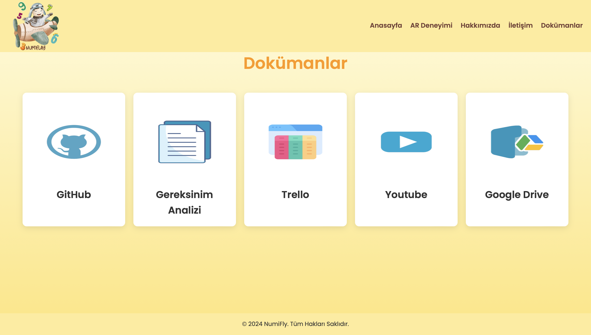

# NumiFly Projesi - README

NumiFly projesi, çocuklar için eğlenceli ve eğitici artırılmış gerçeklik (AR) deneyimi sunar. Uçak içi eğlence sistemleri için tasarlanmış bu proje, internet bağlantısına ihtiyaç duymadan çalışır.

---

## Proje Özellikleri
- Mobil uyumlu ve kullanıcı dostu arayüz.
- Artırılmış gerçeklik (AR) entegrasyonu.
- Sayfa yönlendirmeleri ve bağlantılar (Trello, GitHub, Dökümanlar).
- HTML, CSS, JavaScript ile modern bir tasarım.

---

## Kullanılan Teknolojiler
- **HTML5**: Web sayfası yapısı.
- **CSS3**: Stil ve tasarım.
- **JavaScript**: Dinamik özellikler.
- **OverlyApp**: AR entegrasyonu.

---

## Kurulum ve Çalıştırma
1. Proje dosyalarını indirin veya klonlayın:
   ```bash
   git clone https://github.com/ZeynepAksoy/NumiFly.git

--- 

     ## Ekran Görüntüleri
   1.Anasayfa 
    <table>
     <tr>
       <td></td>
     </tr>
   </table>

    2.Ar Deneyimi
    <table>
     <tr>
       <td></td>
     </tr>
          <tr>
       <td></td>
     </tr>
   </table>

    3.Hakkımızda
    <table>
     <tr>
       <td></td>
     </tr>
   </table>

     ## Ekran Görüntüleri
    4.İletişim
    <table>
     <tr>
       <td></td>
     </tr>
   </table>

    5.Dökümanlar
    <table>
     <tr>
       <td></td>
     </tr>
   </table>

    6.Ar Deneyimini Başlat
    <table>
     <tr>
       <td></td>
     </tr>
   </table>

## İletişim
Sorularınız veya geri bildirimleriniz için lütfen [zeynepaksoy853@gmail.com](mailto:zeynepaksoy853@gmail.com) adresinden benimle iletişime geçin.