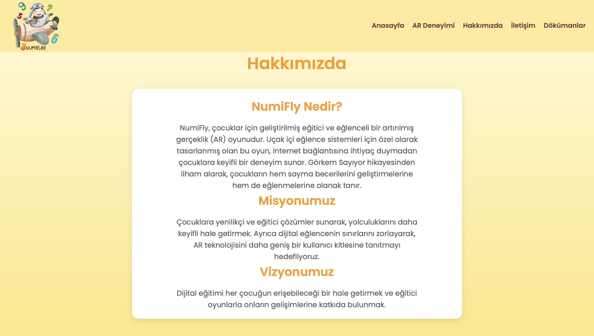
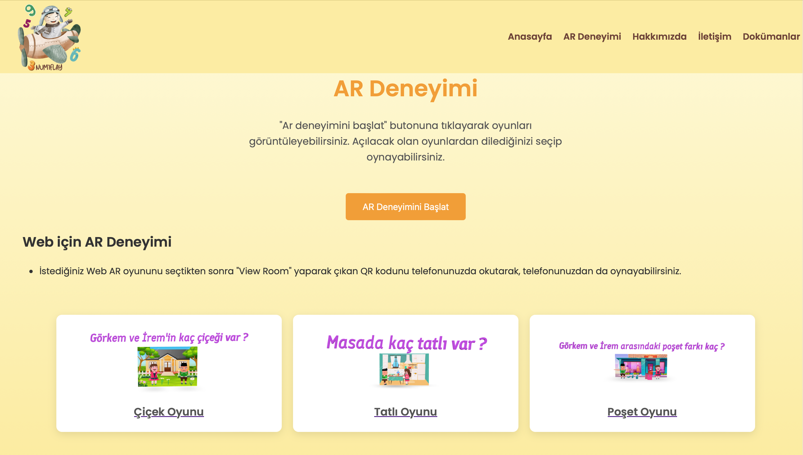

# NumiFly Projesi - README

NumiFly projesi, çocuklar için eğlenceli ve eğitici artırılmış gerçeklik (AR) deneyimi sunar. Uçak içi eğlence sistemleri için tasarlanmıştır.

---

## Proje Özellikleri
- Mobil uyumlu ve kullanıcı dostu arayüz.
- Artırılmış gerçeklik (AR) entegrasyonu.
- Sayfa yönlendirmeleri ve bağlantılar (Trello, GitHub, Dökümanlar).
- HTML, CSS, JavaScript ile modern bir tasarım.

---

## Kullanılan Teknolojiler
- **HTML5**: Web sayfası yapısı.
- **CSS3**: Stil ve tasarım.
- **JavaScript**: Dinamik özellikler.
- **OverlyApp**: AR entegrasyonu.

---

## Kurulum ve Çalıştırma
1. Proje dosyalarını indirin veya klonlayın:
   ```bash
   git clone https://github.com/ZeynepAksoy/NumiFly.git

--- 

## Web Sitesi
[NumiFly Web Sitesi](https://zeynepaksoy.github.io/YMGK-NumiFly/)

--- 
## Dokümanlar
[NumiFly Dökümanlar (Google Drive)](https://drive.google.com/drive/folders/1LCImZStnDPfRoy9Ko_WlM_YDbM5BtplS?usp=share_link)
--- 

## Proje Yönetimi
[NumiFly Proje Yönetimi (Trello)](https://trello.com/b/ZnIYiWKi/ymkg-numifly)

--- 
## Tanıtım Videosu
[Proje Tanıtım Videosu](https://youtu.be/YRzOOWmmDKU)

--- 

## Ekran Görüntüleri
   1.Anasayfa 
  <table>
     <tr>
       <td></td>
     </tr>
  </table>

    2.Ar Deneyimi
  <table>
     <tr>
       <td></td>
     </tr>
          <tr>
       <td></td>
     </tr>
   </table>

    3.Hakkımızda
  <table>
     <tr>
       <td></td>
     </tr>
   </table>

    4.İletişim
   <table>
     <tr>
       <td></td>
     </tr>
   </table>

    5.Dokümanlar
  <table>
     <tr>
       <td></td>
     </tr>
  </table>

    6.Ar Deneyimini Başlat
  <table>
     <tr>
       <td></td>
     </tr>
   </table>

## İletişim
Sorularınız veya geri bildirimleriniz için lütfen [zeynepaksoy853@gmail.com](mailto:zeynepaksoy853@gmail.com) adresinden benimle iletişime geçin.